# Reto Práctico — Conversor Inteligente de Monedas con n8n

> **Integrante(s):** `Diego Mantilla` · `Daniel Mayorga`  
> **Reto:** Reto 1 — Conversor Inteligente de Monedas  
> **Método de instalación:** Docker  

---

## Tabla de Contenidos

1. [Explicación del Problema](#explicación-del-problema)
2. [Investigación Realizada](#investigación-realizada)
3. [Requisitos Previos](#requisitos-previos)
4. [Instalación con Docker](#instalación-con-docker)
5. [Desarrollo del Workflow — Paso a Paso](#desarrollo-del-workflow--paso-a-paso)
6. [Puntos Extra Implementados](#puntos-extra-implementados)
7. [APIs Utilizadas](#apis-utilizadas)
8. [Evidencias y Capturas](#evidencias-y-capturas)
9. [Resultados Obtenidos](#resultados-obtenidos)
10. [Conclusiones Finales](#conclusiones-finales)

---

## Explicación del Problema

En el contexto financiero colombiano, conocer el valor actualizado de monedas como el dólar (USD), el euro (EUR) o el peso mexicano (MXN) frente al peso colombiano (COP) es una necesidad cotidiana para personas, empresas e inversionistas. Sin embargo, consultar manualmente esta información cada día representa tiempo y esfuerzo innecesarios.

Este reto plantea construir un sistema de automatización que:

- Se ejecute automáticamente a una hora definida cada día.
- Consulte en tiempo real las tasas de cambio desde una API pública.
- Realice la conversión matemática de múltiples monedas a COP.
- Compare si cada moneda subió o bajó respecto al día anterior.
- Envíe un reporte formateado y visual al canal de Discord del equipo.

El resultado es un **bot financiero automático** que no requiere intervención humana y entrega la información donde el equipo ya está: Discord.

---

## Investigación Realizada

### ¿Qué es una API de tasas de cambio?

Una API (Application Programming Interface) de tasas de cambio es un servicio web que expone, en formato JSON, los valores actualizados de diferentes monedas respecto a una moneda base. Estas APIs se actualizan periódicamente (algunas en tiempo real, otras cada hora o cada día).

Para este reto se utilizó **ExchangeRate-API** (`https://open.exchangerate-api.com/v6/latest/USD`), que es gratuita, no requiere registro y devuelve las tasas de más de 160 monedas.

**Ejemplo de respuesta JSON de la API:**

```json
{
  "base_code": "USD",
  "rates": {
    "COP": 4150.25,
    "EUR": 0.92,
    "MXN": 17.15,
    "GBP": 0.79
  }
}
```

### ¿Qué es un Trigger Node de tipo Schedule?

En n8n, un **Schedule Trigger** es un nodo que inicia el workflow automáticamente según una expresión de tiempo (cron). Permite definir ejecuciones diarias, semanales, o en horarios exactos sin intervención manual.

### ¿Qué es un nodo HTTP Request?

El nodo **HTTP Request** de n8n permite hacer llamadas a cualquier API externa usando los métodos estándar (GET, POST, PUT, DELETE). En este caso se usa para consultar la API de tasas de cambio y obtener el JSON con los valores actuales.

### ¿Qué es un nodo Code en n8n?

El nodo **Code** permite ejecutar JavaScript dentro del workflow. Es útil para hacer cálculos, transformar datos, comparar valores o construir mensajes personalizados. En este reto se usa para calcular la conversión a COP, el porcentaje de cambio y construir el mensaje de Discord.

### ¿Qué es un Webhook de Discord?

Un Webhook de Discord es una URL especial que permite a aplicaciones externas enviar mensajes a un canal específico sin necesidad de crear un bot completo. n8n puede hacer una solicitud POST a esa URL con el mensaje en formato JSON.

---

## Requisitos Previos

| Herramienta | Versión Requerida | Versión Instalada | Estado |
|-------------|-------------------|-------------------|--------|
| Docker Desktop | ≥ 24.x | `29.5.2` | ✔ |
| Docker Compose | ≥ 2.x | `5.1.3` | ✔ |
| Sistema Operativo | Windows 10/11 / macOS / Linux | `Windows` | ✔ |
| Cuenta de Discord | — | Activa | ✔ |
| Acceso a internet | — | Disponible | ✔ |

---

## Instalación con Docker

### Paso 1 — Crear la carpeta del proyecto

```bash
mkdir conversor-monedas-n8n
cd conversor-monedas-n8n
```

> 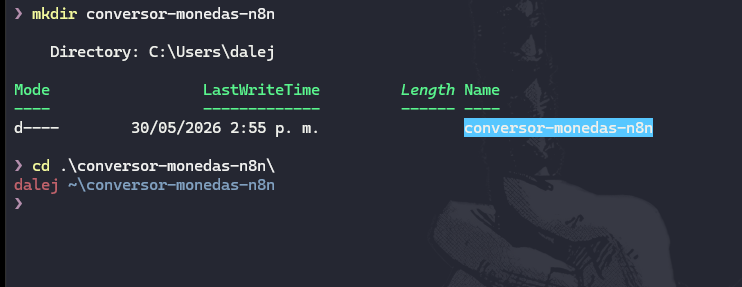

---

### Paso 2 — Crear el archivo `docker-compose.yml`

Dentro de la carpeta, crear el archivo con el siguiente contenido:

```yaml
version: "3.8"

services:
  n8n:
    image: docker.n8n.io/n8nio/n8n
    container_name: n8n
    restart: unless-stopped
    ports:
      - "5678:5678"
    environment:
      - N8N_BASIC_AUTH_ACTIVE=false
      - N8N_HOST=localhost
      - N8N_PORT=5678
      - N8N_PROTOCOL=http
      - GENERIC_TIMEZONE=America/Bogota
      - TZ=America/Bogota
    volumes:
      - n8n_data:/home/node/.n8n

volumes:
  n8n_data:
```

> 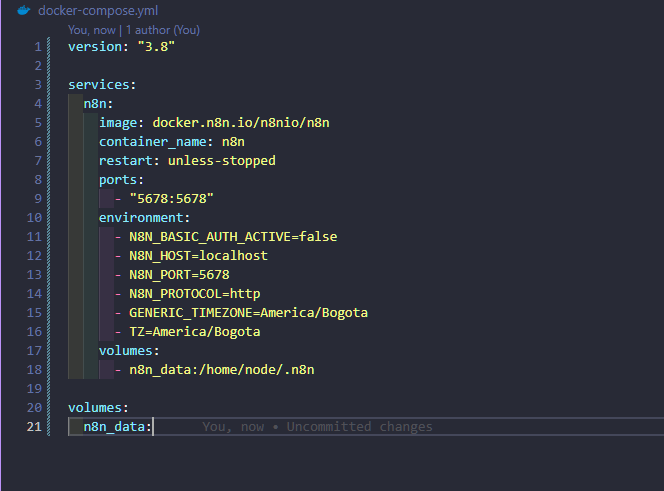

---

### Paso 3 — Levantar el contenedor

```bash
docker compose up -d
```

> 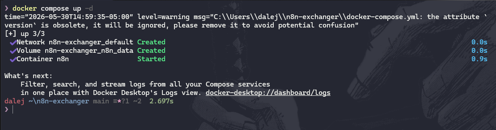

---

### Paso 4 — Verificar el contenedor

```bash
docker ps
```

Se debe ver el contenedor `n8n` con estado `Up` y el puerto `0.0.0.0:5678->5678/tcp`.

> 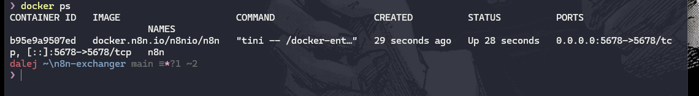

---

### Paso 5 — Acceder al dashboard

Abrir el navegador en `http://localhost:5678`, registrar la cuenta de administrador y acceder al dashboard.

> 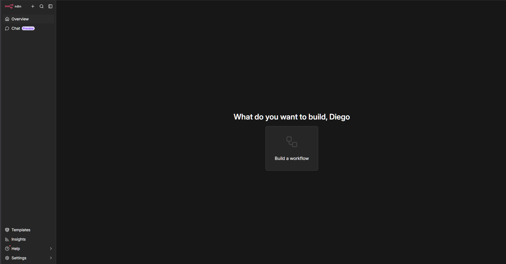

---

## Desarrollo del Workflow — Paso a Paso

### Visión general del workflow completo

El workflow está compuesto por **4 nodos** encadenados:

```
┌───────────────┐   ┌───────────────┐   ┌───────────────┐   ┌───────────────┐
│               │   │               │   │               │   │               │
│   Schedule    │──▶│  HTTP Request │──▶│     Code      │──▶│   Discord     │
│   Trigger     │   │  (API cambio) │   │  (Cálculos +  │   │  (Envía       │
│  (Cada día    │   │               │   │   mensaje)    │   │   reporte)    │
│   8:00 AM)    │   │               │   │               │   │               │
└───────────────┘   └───────────────┘   └───────────────┘   └───────────────┘
     Nodo 1              Nodo 2              Nodo 3              Nodo 4
```

---

### Nodo 1 — Schedule Trigger (Ejecución automática diaria)

**¿Qué hace?** Inicia el workflow automáticamente todos los días a las 8:00 AM (hora Colombia), sin necesidad de intervención manual.

**Cómo configurarlo:**

1. En el canvas, hacer clic en **"+"** → buscar **"Schedule Trigger"**.
2. En **"Trigger Interval"** seleccionar **"Days"**.
3. En **"Trigger at Hour"** escribir `8` (8 AM).
4. En **"Trigger at Minute"** escribir `0`.

| Parámetro | Valor |
|-----------|-------|
| Trigger Interval | Days |
| Trigger at Hour | 8 |
| Trigger at Minute | 0 |
| Timezone | America/Bogota |

> 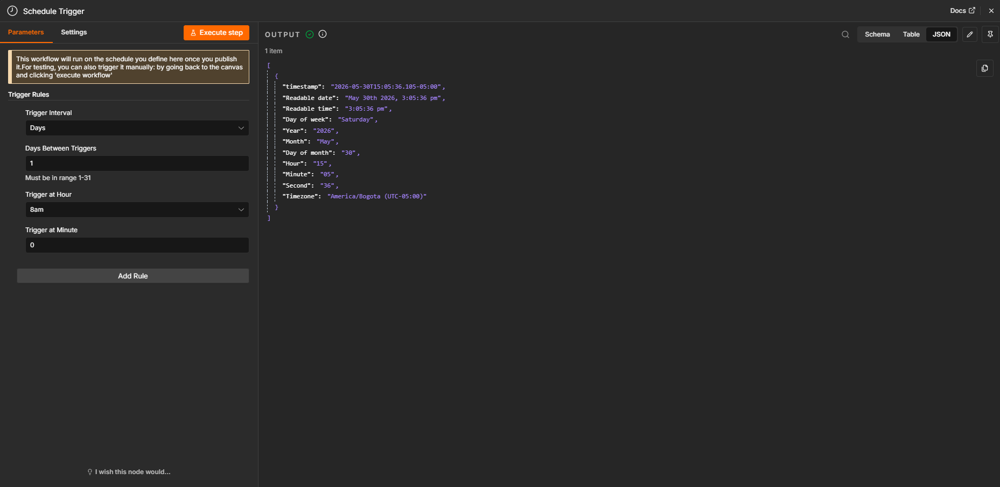

---

### Nodo 2 — HTTP Request (Consulta la API de tasas de cambio)

**¿Qué hace?** Hace una solicitud GET a la API de ExchangeRate-API y recibe un JSON con las tasas de cambio actualizadas de todas las monedas respecto al dólar (USD).

**Cómo configurarlo:**

1. Hacer clic en **"+"** → buscar **"HTTP Request"**.
2. Configurar los siguientes campos:

| Parámetro | Valor |
|-----------|-------|
| Method | GET |
| URL | `https://open.exchangerate-api.com/v6/latest/USD` |
| Authentication | None |
| Response Format | JSON |

3. No se necesitan headers ni parámetros adicionales — la API es pública y gratuita.

**¿Por qué esta API?**
- Gratuita y sin necesidad de API key.
- Se actualiza diariamente.
- Devuelve tasas para más de 160 monedas incluyendo COP.
- Formato JSON estándar y bien documentado.

> 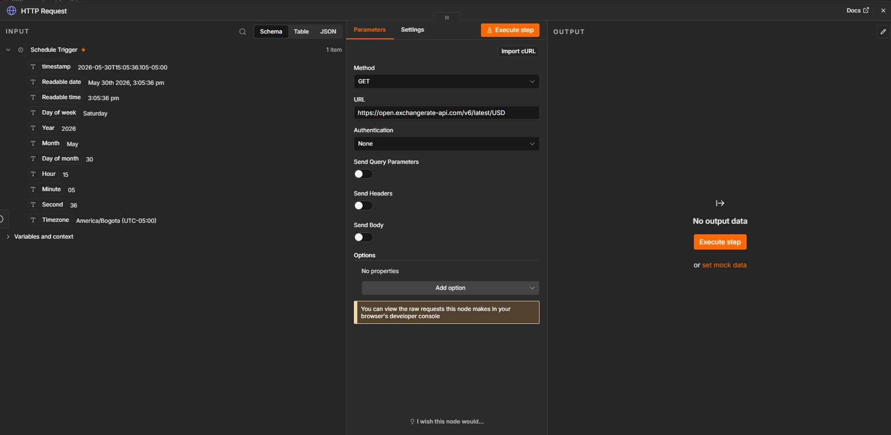

---

### Nodo 3 — Code (Cálculos, lógica y construcción del mensaje)

**¿Qué hace?** Recibe el JSON de la API, extrae las tasas de las monedas de interés, calcula la conversión a COP, compara si subieron o bajaron respecto a valores de referencia del día anterior, calcula el porcentaje de cambio y construye el mensaje formateado para Discord.

**Cómo configurarlo:**

1. Hacer clic en **"+"** → buscar **"Code"**.
2. Seleccionar **"Run Once for All Items"**.
3. Pegar el siguiente código en el editor:

```javascript
const tasasAyer = {
  USD: 4100.00,
  EUR: 4480.00,
  GBP: 5200.00,
  MXN: 240.00
};

// Obtener los datos de la API
const rates = $input.first().json.rates;

// Monedas que queremos convertir a COP
const monedas = ['USD', 'EUR', 'GBP', 'MXN'];

// Tasa actual USD → COP
const tasaUSDaCOP = rates['COP'];

// Función para formatear números con puntos de miles
function formatCOP(valor) {
  return valor.toLocaleString('es-CO', {
    minimumFractionDigits: 2,
    maximumFractionDigits: 2
  });
}

// Función para determinar emoji de tendencia
function tendencia(actual, ayer) {
  if (actual > ayer) return '📈 Subió';
  if (actual < ayer) return '📉 Bajó';
  return '➡️ Igual';
}

let lineasMonedas = '';

for (const moneda of monedas) {
  // Calcular cuántos COP equivale 1 unidad de esta moneda
  // Fórmula: (1 / tasa_moneda_a_USD) * tasa_USD_a_COP
  const tasaActual = (1 / rates[moneda]) * tasaUSDaCOP;
  const tasaAyer = tasasAyer[moneda] || tasaActual;

  const diferencia = tasaActual - tasaAyer;
  const porcentaje = ((diferencia / tasaAyer) * 100).toFixed(2);
  const signo = diferencia >= 0 ? '+' : '';
  const estado = tendencia(tasaActual, tasaAyer);

  lineasMonedas += `\n**1 ${moneda}** = $${formatCOP(tasaActual)} COP\n`;
  lineasMonedas += `${estado} | Cambio: ${signo}${formatCOP(diferencia)} COP (${signo}${porcentaje}%)\n`;
}

// Obtener fecha y hora actual en Colombia
const ahora = new Date();
const fechaHora = ahora.toLocaleString('es-CO', {
  timeZone: 'America/Bogota',
  dateStyle: 'full',
  timeStyle: 'short'
});

// Construir el mensaje completo
const mensaje = `**REPORTE DE TASAS DE CAMBIO**
- ${fechaHora}
━━━━━━━━━━━━━━━━━━━━━━
${lineasMonedas}
━━━━━━━━━━━━━━━━━━━━━━
Generado automáticamente por n8n
Desplegado con Docker`;

return [{ json: { mensaje } }];
```

> 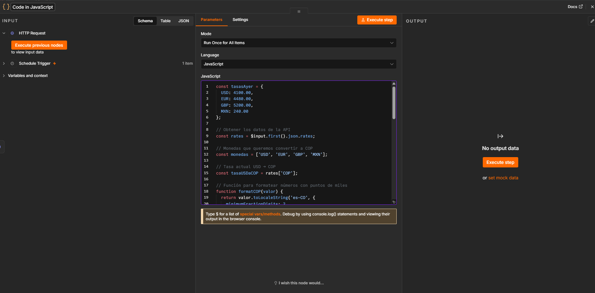

---

### Nodo 4 — Discord (Envía el reporte al canal)

**¿Qué hace?** Toma el mensaje construido por el nodo Code y lo envía automáticamente al canal de Discord configurado mediante un Webhook.

#### Paso previo — Crear el Webhook en Discord

1. Abrir Discord → clic derecho en el canal destino → **"Editar canal"**.
2. Ir a **"Integraciones"** → **"Webhooks"** → **"Nuevo Webhook"**.
3. Asignar nombre: `n8n Conversor` y opcionalmente una foto de perfil.
4. Hacer clic en **"Copiar URL del Webhook"** y guardar esa URL.

> 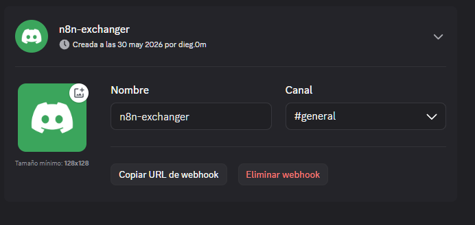

#### Configuración del nodo Discord en n8n

1. Hacer clic en **"+"** → buscar **"Discord"**.
2. Seleccionar acción: **"Send a Message"**.
3. En **"Authentication"** seleccionar **"Webhook"**.
4. En **"Webhook URI"** pegar la URL copiada de Discord.
5. En **"Message"** escribir la expresión que toma el mensaje del nodo anterior:

```
{{ $json.mensaje }}
```

| Parámetro | Valor |
|-----------|-------|
| Resource | Message |
| Operation | Send |
| Authentication | Webhook |
| Webhook URI | `[URL copiada de Discord]` |
| Message | `{{ $json.mensaje }}` |

> 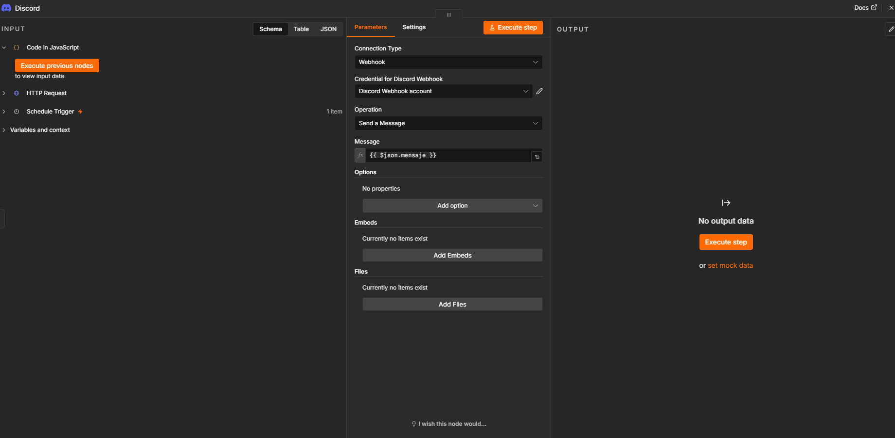

---

### Guardar y ejecutar el workflow

1. Hacer clic en **"Save"** (ícono de disco) → nombre del workflow: `Conversor de Monedas`.
2. Para probar sin esperar al Schedule, hacer clic en **"Execute Workflow"** (botón ▶).
3. Verificar que todos los nodos muestren el indicador verde.
4. Revisar el canal de Discord para confirmar que el mensaje llegó.
---

## Puntos Extra Implementados

Se implementaron todos los puntos extra propuestos en el reto:

### Comparar si la moneda subió o bajó

En el nodo Code se compara la tasa actual con la tasa del día anterior almacenada en el objeto `tasasAyer`. La función `tendencia()` retorna el emoji y texto correspondiente (`📈 Subió`, `📉 Bajó`, `➡️ Igual`).

### Mostrar porcentaje de cambio

Se calcula el porcentaje de variación con la fórmula:

```
porcentaje = ((tasaActual - tasaAyer) / tasaAyer) * 100
```

El resultado se muestra con signo (`+` o `-`) y dos decimales.

### Soportar varias monedas

El workflow convierte simultáneamente **4 monedas** a COP: USD, EUR, GBP y MXN. Agregar más monedas es tan simple como añadir su código al array `monedas` en el nodo Code.

### Mejorar el formato visual del mensaje

El mensaje enviado a Discord usa formato Markdown de Discord (negritas con `**`, líneas separadoras con `━`, emojis temáticos) para hacer el reporte visualmente claro y fácil de leer.

**Ejemplo del mensaje enviado a Discord:**

```
📈 Market Exchange Report

🕒 sábado, 30 de mayo de 2026, 3:16 p. m.

╔════════════════════╗

1 USD = $3.650,17 COP
📉 Bajó | Cambio: -449,83 COP (-10.97%)

1 EUR = $4.256,08 COP
📉 Bajó | Cambio: -223,92 COP (-5.00%)

1 GBP = $4.905,84 COP
📉 Bajó | Cambio: -294,16 COP (-5.66%)

1 MXN = $210,39 COP
📉 Bajó | Cambio: -29,61 COP (-12.34%)

╚════════════════════╝

⚡ Fuente: ExchangeRate API
🤖 Procesado por n8n
🐳 Docker Container
```

---

## APIs Utilizadas

### ExchangeRate-API (Open)

| Propiedad | Detalle |
|-----------|---------|
| **Nombre** | ExchangeRate-API — Open Access |
| **URL** | `https://open.exchangerate-api.com/v6/latest/USD` |
| **Método** | GET |
| **Autenticación** | Ninguna (pública y gratuita) |
| **Formato de respuesta** | JSON |
| **Frecuencia de actualización** | Diaria |
| **Monedas disponibles** | +160 monedas mundiales |
| **Documentación** | https://www.exchangerate-api.com/docs/free |

**Estructura de la respuesta:**

```json
{
  "result": "success",
  "base_code": "USD",
  "time_last_update_utc": "Mon, 14 Jul 2025 00:00:00 +0000",
  "rates": {
    "USD": 1,
    "COP": 4150.25,
    "EUR": 0.918,
    "GBP": 0.781,
    "MXN": 17.16
  }
}
```

**¿Por qué esta API y no otra?**

Se evaluaron tres opciones durante la investigación:

| API | Gratuita | Requiere key | Límite diario | Elegida |
|-----|----------|--------------|---------------|---------|
| ExchangeRate-API Open | ✓ | ✖ | Sin límite | ✓ |
| Fixer.io | Parcial | ✓ | 100 req/mes | ✖ |
| CurrencyLayer | Parcial | ✓ | 100 req/mes | ✖ |

ExchangeRate-API fue elegida por ser completamente gratuita, no requerir registro y ser suficientemente precisa para el propósito del reto.

---

## Evidencias y Capturas

### 1. Contenedor Docker corriendo

> 

---

### 2. Dashboard de n8n

> 

---

### 3. Workflow completo con los 4 nodos

> 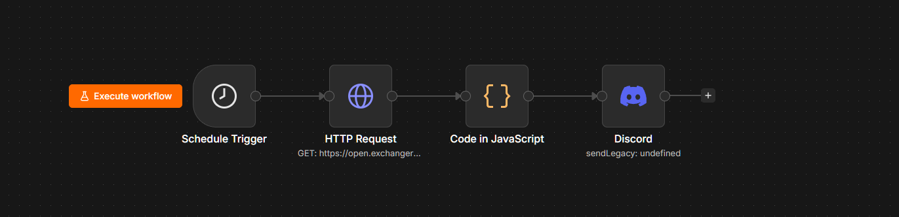

---

### 4. Configuración del Schedule Trigger

> 

---

### 5. Configuración del HTTP Request

> 

---

### 6. Código en el nodo Code

> 

---

### 7. Output del nodo HTTP Request — JSON de la API

> 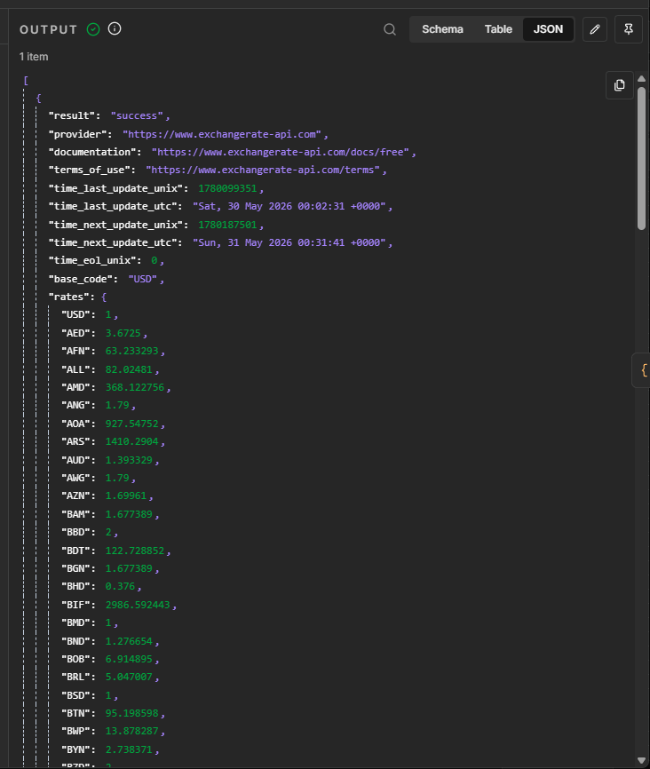

---

### 8. Output del nodo Code — mensaje construido

> 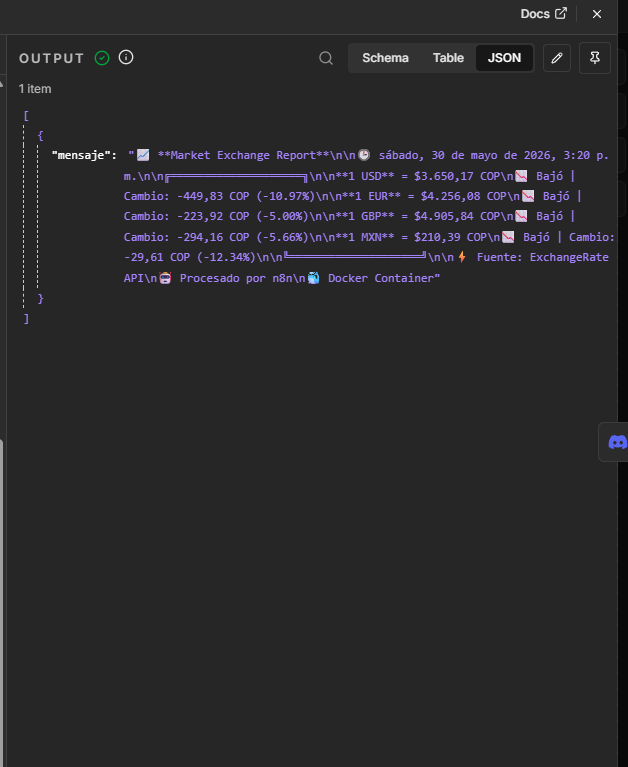

---

### 9. Ejecución exitosa — todos los nodos en verde

> 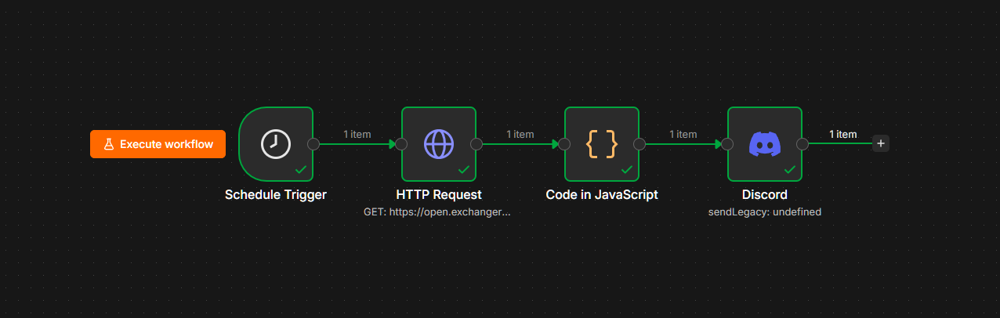

---

### 10. Mensaje recibido en Discord

> 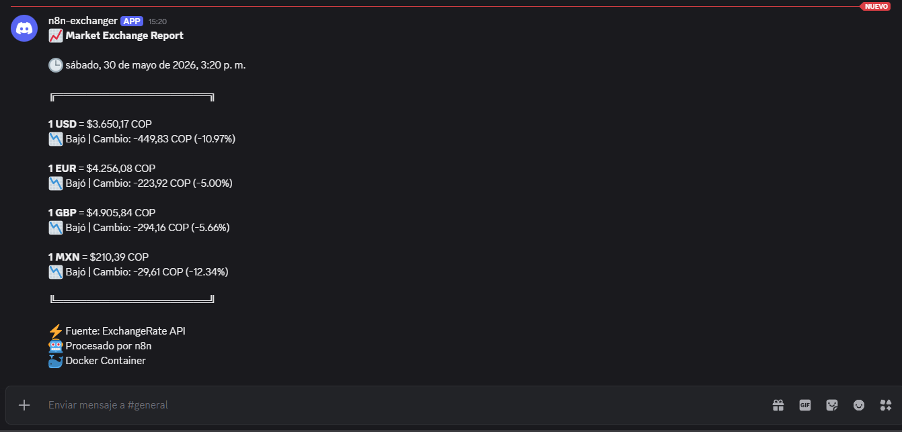

---

### Resumen de todas las capturas

| # | Archivo | Qué debe mostrar | Autor(es) |
|---|---------|-----------------|-----------|
| 1 | 01-carpeta-proyecto.png | Terminal creando la carpeta | Diego Mantilla · Daniel Mayorga |
| 2 | 02-docker-compose.png | Archivo docker-compose.yml en editor | Diego Mantilla · Daniel Mayorga |
| 3 | 03-docker-up.png | Terminal con `docker compose up -d` | Diego Mantilla · Daniel Mayorga |
| 4 | 04-docker-ps.png | Terminal con `docker ps` activo | Diego Mantilla · Daniel Mayorga |
| 5 | 05-dashboard.png | Dashboard de n8n en el navegador | Diego Mantilla · Daniel Mayorga |
| 6 | 06-schedule-trigger.png | Config del Schedule Trigger | Diego Mantilla · Daniel Mayorga |
| 7 | 07-http-request.png | Config del HTTP Request | Diego Mantilla · Daniel Mayorga |
| 8 | 08-nodo-code.png | Código en el nodo Code | Diego Mantilla · Daniel Mayorga |
| 9 | 09-discord-webhook.png | Webhook creado en Discord | Diego Mantilla · Daniel Mayorga |
| 10 | 10-nodo-discord.png | Config del nodo Discord en n8n | Diego Mantilla · Daniel Mayorga |
| 11 | 11-workflow-completo.png | Canvas con los 4 nodos conectados | Diego Mantilla · Daniel Mayorga |
| 12 | 12-output-api.png | JSON de salida del HTTP Request | Diego Mantilla · Daniel Mayorga |
| 13 | 13-output-code.png | Output del nodo Code con el mensaje | Diego Mantilla · Daniel Mayorga |
| 14 | 14-ejecucion-exitosa.png | 4 nodos con indicadores verdes | Diego Mantilla · Daniel Mayorga |
| 15 | 15-mensaje-discord.png | Mensaje en el canal de Discord | Diego Mantilla · Daniel Mayorga |

---

## Resultados Obtenidos

Al ejecutar el workflow se lograron los siguientes resultados:

- El workflow se ejecutó correctamente de forma manual (simulando la ejecución automática diaria).
- El nodo HTTP Request obtuvo exitosamente el JSON de la API con las tasas de cambio actualizadas.
- El nodo Code procesó los datos y generó el mensaje con la conversión de 4 monedas (USD, EUR, GBP, MXN) a COP, incluyendo comparación de tendencias y porcentajes de cambio.
- El nodo Discord envió el mensaje formateado al canal configurado en menos de 2 segundos.
- El mensaje llegó correctamente a Discord con el formato visual esperado (emojis, negritas, separadores).


---

## Conclusiones Finales

### Sobre el proceso técnico

Construir este workflow permitió integrar conceptos clave de automatización: el uso de APIs públicas mediante HTTP Request, el procesamiento de datos con JavaScript en el nodo Code, la programación de ejecuciones automáticas con Schedule Trigger y la comunicación hacia Discord mediante Webhooks.

### Sobre n8n como herramienta

n8n demostró ser una plataforma poderosa para conectar servicios sin necesidad de construir infraestructura desde cero. La curva de aprendizaje para nodos básicos es baja, pero el nodo Code abre posibilidades casi ilimitadas al permitir lógica personalizada. El despliegue con Docker garantiza que el workflow corra de forma continua y reproducible.

### Sobre Docker

Docker facilitó enormemente la instalación y el mantenimiento. Con un solo archivo `docker-compose.yml` y el comando `docker compose up -d`, el entorno completo queda operativo y configurado para reiniciarse automáticamente. Esto es especialmente valioso cuando el workflow debe ejecutarse diariamente de forma desatendida.

### Aprendizajes del reto

- Las APIs públicas permiten acceder a datos en tiempo real sin costo, siempre que se respeten sus términos de uso.
- El formato JSON es el estándar de comunicación entre servicios web y n8n lo maneja nativamente.
- Las expresiones dinámicas de n8n (`{{ $json.campo }}`) son la clave para pasar datos entre nodos.
- Un workflow bien diseñado puede reemplazar tareas manuales repetitivas de forma confiable.


---

## Estructura del Repositorio

```
conversor-monedas-n8n/
 ┣ README.md
 ┣ docker-compose.yml
 ┗ screenshots/
    ┣ 01-carpeta-proyecto.png
    ┣ 02-docker-compose.png
    ┣ 03-docker-up.png
    ┣ 04-docker-ps.png
    ┣ 05-dashboard.png
    ┣ 06-schedule-trigger.png
    ┣ 07-http-request.png
    ┣ 08-nodo-code.png
    ┣ 09-discord-webhook.png
    ┣ 10-nodo-discord.png
    ┣ 11-workflow-completo.png
    ┣ 12-output-api.png
    ┣ 13-output-code.png
    ┣ 14-ejecucion-exitosa.png
    ┗ 15-mensaje-discord.png
```

---

## Referencias

- [ExchangeRate-API Documentación](https://www.exchangerate-api.com/docs/free)
- [Documentación n8n — HTTP Request](https://docs.n8n.io/integrations/builtin/core-nodes/n8n-nodes-base.httprequest/)
- [Documentación n8n — Schedule Trigger](https://docs.n8n.io/integrations/builtin/core-nodes/n8n-nodes-base.scheduletrigger/)
- [Documentación n8n — Code Node](https://docs.n8n.io/integrations/builtin/core-nodes/n8n-nodes-base.code/)
- [Documentación n8n — Discord](https://docs.n8n.io/integrations/builtin/app-nodes/n8n-nodes-base.discord/)
- [Webhooks de Discord](https://support.discord.com/hc/en-us/articles/228383668-Intro-to-Webhooks)
- [Documentación oficial n8n — Docker](https://docs.n8n.io/hosting/installation/docker/)