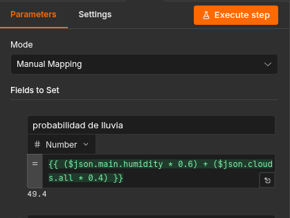
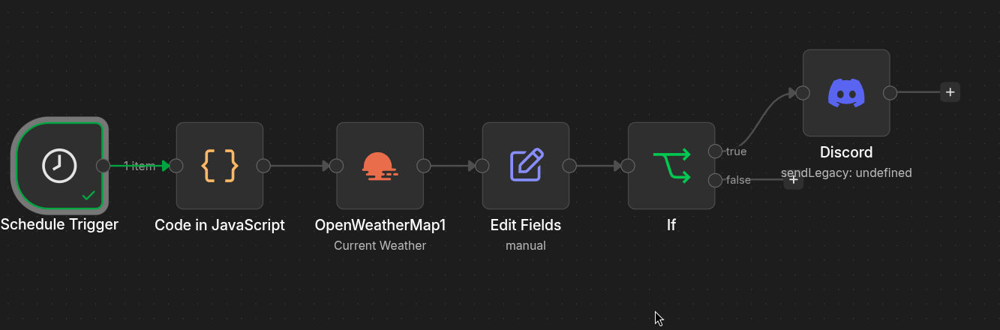
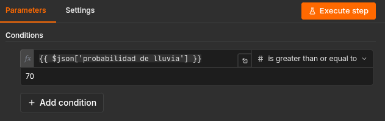
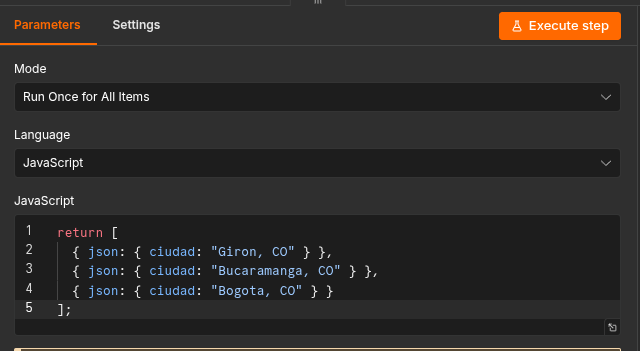
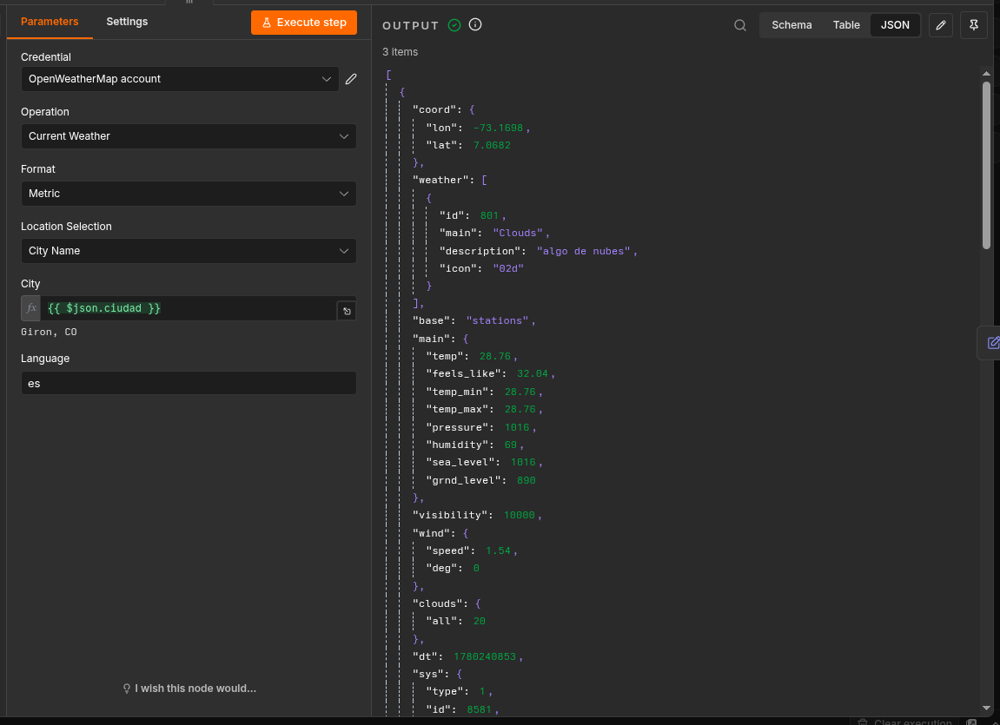
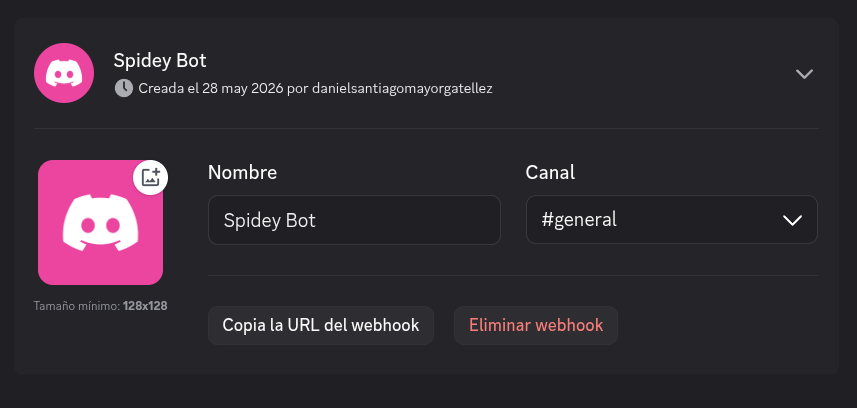
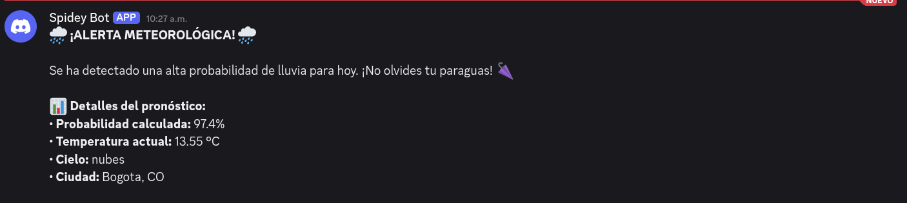

<div align="center">

<h1 align="center">
  🌩️ SISTEMA DE ALERTAS CLIMÁTICAS 🚨
</h1>
<p align="center">
  <i>Monitoreo, prevención y notificaciones meteorológicas en tiempo real</i>
</p>
<br>

[](https://n8n.io/)
[](https://openweathermap.org/)
[](https://discord.com/)
[](https://developer.mozilla.org/es/docs/Web/JavaScript)
[](.)

</div>

<br>

```
════════════════════════════════════════════════════════════════════════════════
  RETO 2 — CampusLands n8n Challenge  |  Stack: n8n + OpenWeatherMap + Discord
════════════════════════════════════════════════════════════════════════════════
```

<br>

## Tabla de contenidos

| # | Seccion |
|:-:|---------|
| 1 | [Explicacion del problema](#1--explicacion-del-problema) |
| 2 | [Investigacion realizada](#2--investigacion-realizada) |
| 3 | [Prerrequisitos](#3--prerrequisitos) |
| 4 | [Desarrollo paso a paso](#4--desarrollo-paso-a-paso) |
| 5 | [Capturas del workflow](#5--capturas-del-workflow) |
| 6 | [APIs utilizadas](#6--apis-utilizadas) |
| 7 | [Resultados obtenidos](#7--resultados-obtenidos) |
| 8 | [Capturas de Discord](#8--capturas-de-discord) |
| 9 | [Conclusiones finales](#9--conclusiones-finales) |

<br>

---

## 1 — Explicacion del problema

### Contexto

El monitoreo del clima de forma manual es ineficiente y propenso a errores humanos. Las aplicaciones meteorologicas genericas envian notificaciones sin distincion, lo que genera fatiga de alertas en los usuarios, quienes terminan ignorandolas por completo.

### Problema central

Se necesita un sistema que:
- Consulte el clima automaticamente en horarios programados.
- Evalue **matematicamente** si realmente existe riesgo de lluvia.
- Notifique **solo cuando sea necesario**, respetando la atencion del usuario.
- Sea capaz de monitorear **multiples ciudades simultaneamente** sin duplicar la logica del flujo.

### Objetivo

Construir una automatizacion robusta con n8n que actue como un asistente meteorologico inteligente, aplicando una formula de ponderacion propia para calcular la probabilidad real de lluvia y enviando alertas enriquecidas a Discord unicamente cuando el umbral de riesgo lo justifica.

### Reglas de negocio

| Regla | Descripcion |
|:------|:------------|
| **Umbral de alerta** | Solo se notifica si `probabilidad_lluvia >= 70%` |
| **Cero spam** | Si ninguna ciudad supera el umbral, no se envia ningun mensaje |
| **Multi-ciudad** | El flujo evalua todas las ciudades en una sola ejecucion |
| **Horario automatico** | El sistema se ejecuta solo, sin intervencion manual |

<br>

---

## 2 — Investigacion realizada

### APIs meteorologicas evaluadas

Se evaluaron varias APIs antes de seleccionar la solucion final:

| API | Ventaja | Desventaja | Seleccionada |
|:----|:--------|:-----------|:------------:|
| **OpenWeatherMap** | Gratuita, baja latencia, respuesta JSON detallada | Limite de 60 req/min en tier free | **SI** |
| WeatherAPI | Interfaz amigable | Menos datos en tier gratuito | NO |
| Open-Meteo | Sin API key requerida | Menor cobertura en ciudades colombianas | NO |

**Eleccion final: OpenWeatherMap** — provee variables clave como `main.humidity`, `clouds.all`, `main.temp` y `weather[0].description` con la granularidad necesaria para calcular la probabilidad de lluvia de forma matematica.

<br>

### Formula de probabilidad de lluvia

Tras investigar los factores meteorologicos mas correlacionados con la precipitacion, se diseno la siguiente formula ponderada:

```
┌─────────────────────────────────────────────────────────┐
│                                                         │
│   probabilidad_lluvia = (Humedad × 0.6) + (Nubosidad × 0.4)  │
│                                                         │
└─────────────────────────────────────────────────────────┘
```



**Justificacion de los pesos:**

| Variable | Peso | Razon |
|:---------|:----:|:------|
| **Humedad** | 60% | Indicador mas directo de precipitacion inminente. Humedad > 80% es altamente predictiva. |
| **Nubosidad** | 40% | Complementa la humedad. Cielo nublado sin alta humedad puede no generar lluvia. |

> **Ejemplo practico:**
> Humedad = 85%, Nubosidad = 90%
> `(85 × 0.6) + (90 × 0.4) = 51 + 36 = 87%` → **ALERTA ENVIADA**

<br>

### Arquitectura del workflow — Diagrama de flujo

```
  ┌─────────────────┐
  │  SCHEDULE       │
  │  TRIGGER        │   Dispara el flujo todos
  │  07:00 AM diario│   los dias a las 7 AM
  └────────┬────────┘
           │
           v
  ┌─────────────────┐
  │  CODE NODE      │   Genera array con N ciudades
  │  Lista ciudades │   [ Giron, Bucaramanga, Bogota ]
  │  [JavaScript]   │   Cada item se procesa por separado
  └────────┬────────┘
           │  (3 items)
           v
  ┌─────────────────┐
  │  OPENWEATHERMAP │   Consulta la API para
  │  API Request    │   CADA ciudad del array
  │  x ciudad       │   Retorna: temp, humedad, nubosidad
  └────────┬────────┘
           │
           v
  ┌─────────────────┐
  │  EDIT FIELDS    │   Calcula probabilidad_lluvia
  │  Transformacion │   = (Humedad × 0.6) + (Nubosidad × 0.4)
  │  de datos       │   Normaliza campos del JSON
  └────────┬────────┘
           │
           v
  ┌─────────────────┐
  │  IF NODE        │
  │  prob >= 70?    │
  └────┬───────┬────┘
       │ TRUE  │ FALSE
       │       │
       v       v
  ┌─────────┐  ┌──────────────┐
  │ DISCORD │  │  [FIN]       │
  │ Alerta  │  │  Sin accion  │
  │ enviada │  │  Cero spam   │
  └─────────┘  └──────────────┘
```

### Nodos clave estudiados

<details>
<summary><strong>Ver descripcion de cada nodo utilizado</strong></summary>

<br>

| Nodo | Funcion |
|:-----|:--------|
| **Schedule Trigger** | Disparador basado en cron para ejecuciones programadas sin intervencion manual |
| **Code Node** | Ejecucion de JavaScript puro para generar o transformar datos estructurados |
| **OpenWeatherMap Node** | Conexion nativa a la API meteorologica con manejo de credenciales |
| **Edit Fields (Set Node)** | Creacion y transformacion de variables calculadas a partir de datos crudos |
| **IF Node** | Logica condicional booleana para bifurcar el flujo segun el umbral definido |
| **Discord Node** | Envio de mensajes Markdown formateados mediante bot o webhook |

</details>

<br>

---

## 3 — Prerrequisitos

Antes de comenzar, asegurate de tener lo siguiente:

### Herramientas necesarias

- [n8n](https://n8n.io/) instalado localmente **o** cuenta en [n8n.io Cloud](https://app.n8n.io/)
- Cuenta gratuita en [OpenWeatherMap](https://openweathermap.org/api)
- Servidor de Discord con permisos para crear bots o webhooks

<br>

<details>
<summary><strong>Como obtener la API Key de OpenWeatherMap</strong></summary>

<br>

```
PASO 1  →  Registrate en https://openweathermap.org/
PASO 2  →  Ve a tu perfil  →  "My API Keys"
PASO 3  →  Copia la API Key predeterminada (o crea una nueva)
PASO 4  →  Espera hasta 2 horas para que la key se active por primera vez
```

> **Nota:** El tier gratuito permite hasta 1,000 llamadas diarias, suficiente para monitorear decenas de ciudades con ejecuciones cada hora.

</details>

<details>
<summary><strong>Como configurar el bot de Discord</strong></summary>

<br>

**Opcion A — Webhook (mas simple):**

```
1. Ve a tu servidor de Discord  →  canal destino  →  [Editar canal]
2. Seccion "Integraciones"  →  "Webhooks"  →  "Nuevo Webhook"
3. Asigna un nombre y foto al bot
4. Copia la URL del Webhook generada
```

**Opcion B — Bot con token (usada en este proyecto):**

```
1. Ve al Discord Developer Portal  →  "New Application"
2. Seccion "Bot"  →  "Add Bot"  →  Copia el Token
3. OAuth2  →  URL Generator  →  Scopes: [bot]  →  Permisos: [Send Messages]
4. Usa la URL generada para invitar el bot a tu servidor
```

</details>

<br>

---

## 4 — Desarrollo paso a paso

### Paso 1 — Crear un nuevo workflow en n8n

```
1. Abre n8n y haz clic en "New Workflow"
2. Asigna el nombre:  Sistema de Alertas Climaticas
3. Guarda con  Ctrl + S  antes de comenzar
```

---

### Paso 2 — Nodo Schedule Trigger

> Este nodo inicia el flujo automaticamente segun el horario definido.

| Parametro | Valor |
|:----------|:------|
| Trigger Interval | `Days` |
| Days Between Triggers | `1` |
| Trigger at Hour | `7` |
| Trigger at Minute | `0` |

```
// Alternativa con expresion cron:
0 7 * * *   →   Cada dia a las 7:00 AM
```

---

### Paso 3 — Nodo Code (Lista de ciudades)

> Este nodo inyecta el array de ciudades. Cada objeto del array se convierte en un item independiente que recorre el resto del flujo.

- **Language:** `JavaScript`
- **Mode:** `Run Once for All Items`

```javascript
return [
  { json: { ciudad: "Giron, CO" } },
  { json: { ciudad: "Bucaramanga, CO" } },
  { json: { ciudad: "Bogota, CO" } }
];
```

> **Para agregar mas ciudades:** Incorpora objetos al array con el formato `{ ciudad: "Nombre,CodigoPais" }`.
> Los codigos de pais siguen el estandar ISO 3166-1 alpha-2: CO = Colombia, MX = Mexico, US = Estados Unidos.

---

### Paso 4 — Nodo OpenWeatherMap

> Consulta la API por cada ciudad del array de forma automatica.

**Configuracion de credenciales:**
```
1. Haz clic en "Create new credential"
2. Pega tu API Key de OpenWeatherMap
3. Guarda como:  OpenWeatherMap API
```

**Parametros del nodo:**

| Campo | Valor |
|:------|:------|
| Operation | `Current Weather` |
| City | `{{ $json.ciudad }}` |
| Language | `Spanish` |

**Variables clave de la respuesta JSON:**

```
main.humidity          →  Humedad relativa (0-100%)
clouds.all             →  Porcentaje de nubosidad (0-100%)
main.temp              →  Temperatura actual en Celsius
name                   →  Nombre oficial de la ciudad
weather[0].description →  Descripcion textual del clima
```

---

### Paso 5 — Nodo Edit Fields (Calcular probabilidad)

> Transforma los datos crudos de la API y calcula la metrica de riesgo de lluvia.

Agrega los siguientes campos en el nodo **Edit Fields (Set)**:

| Nombre del campo | Tipo | Expresion |
|:-----------------|:----:|:----------|
| `ciudad` | String | `{{ $json.name }}` |
| `temperatura` | Number | `{{ $json.main.temp }}` |
| `humedad` | Number | `{{ $json.main.humidity }}` |
| `nubosidad` | Number | `{{ $json.clouds.all }}` |
| `descripcion` | String | `{{ $json.weather[0].description }}` |
| `probabilidad_lluvia` | Number | `{{ ($json.main.humidity * 0.6) + ($json.clouds.all * 0.4) }}` |

```
[!] Activa la opcion "Keep Only Set" para limpiar campos innecesarios
    de la respuesta cruda de la API antes de pasar al nodo IF.
```

---

### Paso 6 — Nodo IF (Filtro logico de alertas)

> Este nodo bifurca el flujo. Solo las ciudades con alta probabilidad de lluvia avanzan hacia la notificacion.

**Condicion configurada:**

```
┌────────────────────────────────────────────┐
│  Value 1:  {{ $json.probabilidad_lluvia }} │
│  Operador: Greater than or equal to        │
│  Value 2:  70                              │
└────────────────────────────────────────────┘
```

**Resultado de las ramas:**

```
  TRUE  →  prob_lluvia >= 70  →  Continua al nodo Discord
  FALSE →  prob_lluvia <  70  →  [FIN] Rama vacia, no se envia nada
```

> **Diseno intencional:** La rama *False* se deja vacia para implementar la politica de cero spam. Si ninguna ciudad supera el umbral, el workflow finaliza sin ninguna notificacion.

---

### Paso 7 — Nodo Discord (Envio de la alerta)

> Envia el mensaje formateado al canal de Discord configurado.

**Credenciales:** Selecciona `Bot Token` o `Webhook URL` segun tu configuracion.

**Plantilla del mensaje** (sintaxis Markdown de Discord):

```
**ALERTA DE LLUVIA — {{ $json.ciudad }}**

Probabilidad de lluvia:  {{ Math.round($json.probabilidad_lluvia) }}%
Temperatura actual:      {{ $json.temperatura }}°C
Humedad:                 {{ $json.humedad }}%
Nubosidad:               {{ $json.nubosidad }}%
Condicion:               {{ $json.descripcion }}

Se recomienda llevar paraguas hoy.
```

---

### Paso 8 — Activar el workflow

```
1. Verifica que todos los nodos esten conectados en la vista del flujo
2. Haz clic en el toggle "Active" (esquina superior derecha)
3. El sistema comenzara a ejecutarse segun el horario configurado
```

> Para una prueba inmediata sin esperar el horario, haz clic en **"Execute Workflow"**.

<br>

---

## 5 — Capturas del workflow

### Vista general del flujo completo

Arquitectura completa del workflow mostrando la cadena de nodos:
`Schedule Trigger` → `Code` → `OpenWeatherMap` → `Edit Fields` → `IF` → `Discord`



---

### Configuracion del nodo IF (Filtro logico)

Detalle de la condicion configurada en el nodo IF: `probabilidad_lluvia >= 70`.



---

### Salida del nodo Code (Array de ciudades)

JSON generado por el nodo Code con los 3 items que representan las ciudades a monitorear.



<br>

---

## 6 — APIs utilizadas

### OpenWeatherMap API — Current Weather Data

<div align="center">

[](https://openweathermap.org/current)

</div>

| Detalle | Valor |
|:--------|:------|
| **Endpoint** | `https://api.openweathermap.org/data/2.5/weather` |
| **Metodo** | `GET` |
| **Autenticacion** | API Key (query param `appid`) |
| **Tier utilizado** | Free (hasta 1,000 llamadas/dia) |
| **Formato de respuesta** | JSON |

**Parametros de la peticion:**

```bash
q       = {ciudad},{pais}   # Ej: "Bucaramanga,CO"
appid   = {tu_api_key}
units   = metric            # Temperatura en Celsius
lang    = es                # Descripciones en espanol
```

**Fragmento de respuesta JSON:**

```json
{
  "name": "Bucaramanga",
  "main": {
    "temp": 28.4,
    "humidity": 82
  },
  "clouds": {
    "all": 75
  },
  "weather": [
    {
      "description": "nubes dispersas"
    }
  ]
}
```



<br>

---

### Discord API — Bot de notificaciones

<div align="center">

[](https://discord.com/developers/docs)

</div>

| Detalle | Valor |
|:--------|:------|
| **Metodo de integracion** | Bot Token (nodo nativo de n8n) |
| **Permisos requeridos** | `Send Messages`, `Embed Links` |
| **Formato de mensaje** | Markdown de Discord |
| **Trigger** | Condicional (solo si `probabilidad_lluvia >= 70`) |

El bot fue creado desde el Discord Developer Portal e invitado al servidor con los permisos minimos necesarios para operar.



<br>

---

## 7 — Resultados obtenidos

### Tabla de escenarios — Sistema de filtrado

El nodo IF actua como guardian que garantiza la relevancia de cada notificacion:

| Escenario | Humedad | Nubosidad | Probabilidad calculada | Resultado |
|:----------|:-------:|:---------:|:----------------------:|:---------:|
| Dia lluvioso | 85% | 90% | **87%** | ALERTA ENVIADA |
| Dia nublado con humedad | 65% | 80% | **71%** | ALERTA ENVIADA |
| Dia parcialmente nublado | 55% | 60% | **57%** | SIN NOTIFICACION |
| Dia despejado | 30% | 10% | **22%** | SIN NOTIFICACION |

<br>

### Procesamiento multi-ciudad independiente

```
Ejecucion unica  →  3 ciudades evaluadas en paralelo

  Bogota:      prob = 87%  →  ALERTA ENVIADA
  Bucaramanga: prob = 71%  →  ALERTA ENVIADA
  Giron:       prob = 52%  →  [SIN NOTIFICACION]

  Resultado: 2 mensajes enviados, 1 ciudad filtrada
```

El motor de items de n8n aisla cada ciudad de forma independiente. Si Bogota supera el umbral y Giron no, el nodo IF filtra solo el item negativo y notifica exclusivamente el positivo.

<br>

### Cumplimiento de reglas de negocio

| Regla | Estado |
|:------|:------:|
| Umbral de alerta al 70% | **[OK]** Implementado y verificado |
| Cero spam en dias despejados | **[OK]** Rama False vacia confirmada |
| Procesamiento multi-ciudad | **[OK]** 3 ciudades en una ejecucion |
| Ejecucion automatica programada | **[OK]** Cron configurado a las 7 AM |

<br>

---

## 8 — Capturas de Discord

### Evidencia de funcionamiento — Alerta recibida en Discord

Mensaje de alerta recibido en el canal de Discord cuando la probabilidad de lluvia supero el umbral del 70%. Se puede observar el formato enriquecido con las variables dinamicas de temperatura, humedad, nubosidad y probabilidad calculada.



<br>

---

## 9 — Conclusiones finales

### Lo que aprendimos

**1. El poder del procesamiento por items de n8n**
No fue necesario construir bucles visuales complejos para manejar multiples ciudades. Al generar un array desde el nodo Code, n8n itera automaticamente cada item a traves de los nodos siguientes, reduciendo significativamente la complejidad visual del flujo.

**2. La importancia de transformar los datos antes de aplicar logica**
El nodo Edit Fields actua como una capa de normalizacion critica. Sin el, seria imposible aplicar la formula de probabilidad o estructurar el mensaje de Discord de forma limpia. Siempre se deben transformar los datos crudos antes de tomar decisiones condicionales.

**3. La politica de cero spam es una decision de diseno, no una limitacion**
Dejar la rama *False* del nodo IF intencionalmente vacia es una decision deliberada de arquitectura. Un sistema que notifica cuando no hay nada importante que comunicar pierde la confianza del usuario a largo plazo.

**4. Las formulas propias superan los campos predefinidos**
OpenWeatherMap provee un campo `pop` (probability of precipitation) en su endpoint de pronostico, pero no en el de clima actual. Disenar una formula propia a partir de variables correlacionadas demostro ser una solucion efectiva y totalmente personalizable.

**5. n8n como plataforma de produccion real**
La combinacion de Schedule Trigger + procesamiento condicional + notificacion a mensajeria instantanea es un patron de arquitectura utilizado en sistemas de alertas empresariales reales. Este proyecto demuestra que n8n no es solo una herramienta de prototipado.

<br>

### Posibles mejoras futuras

<details>
<summary><strong>Ver roadmap de mejoras</strong></summary>

<br>

| Mejora | Descripcion |
|:-------|:------------|
| **Pronostico extendido** | Integrar el endpoint `/forecast` para alertar con 5 dias de anticipacion |
| **Historial de alertas** | Agregar nodo Spreadsheet o Airtable para registrar cada notificacion enviada |
| **Canal de Telegram** | Configurar Telegram como canal alternativo de notificacion |
| **Severidad dinamica** | Logica de niveles: moderada / alta / critica segun el porcentaje calculado |
| **Geolocalizacion** | Consultar ciudades basadas en la ubicacion de usuarios registrados |

</details>

<br>

---

```
════════════════════════════════════════════════════════════════════════════════
  Desarrollado por: Daniel Santiago Mayorga
  Stack: n8n  |  OpenWeatherMap API  |  Discord Bot API
  Rama: feature/daniel/reto2  |  CampusLands n8n Challenge
════════════════════════════════════════════════════════════════════════════════
```
